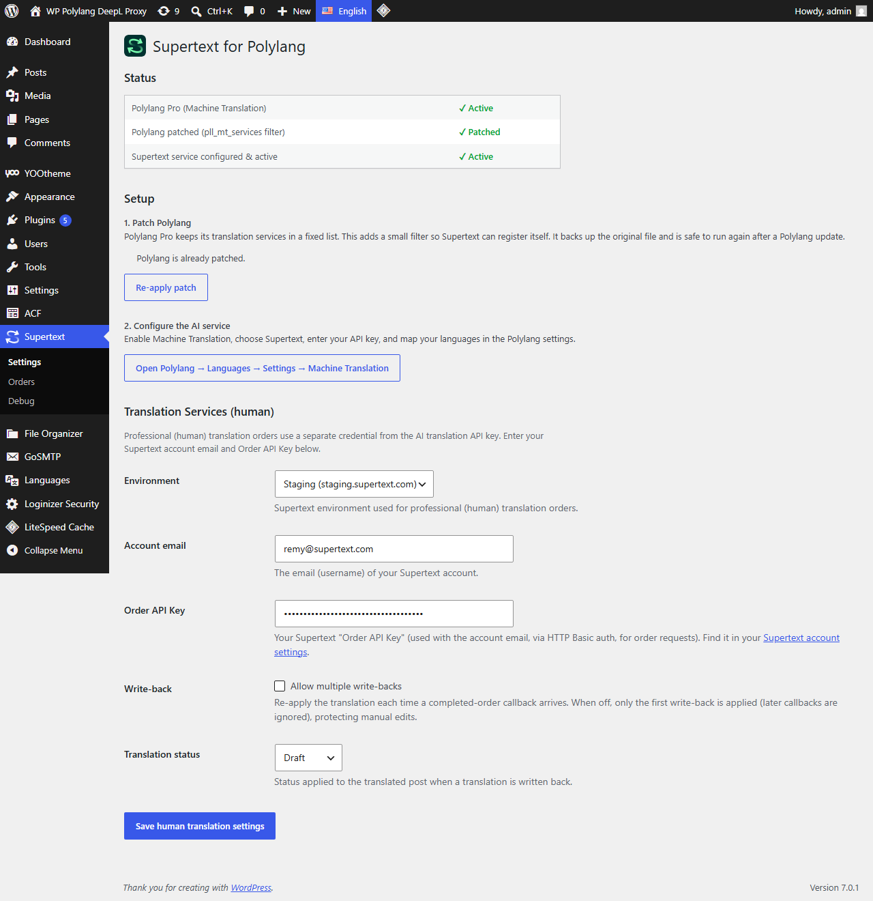
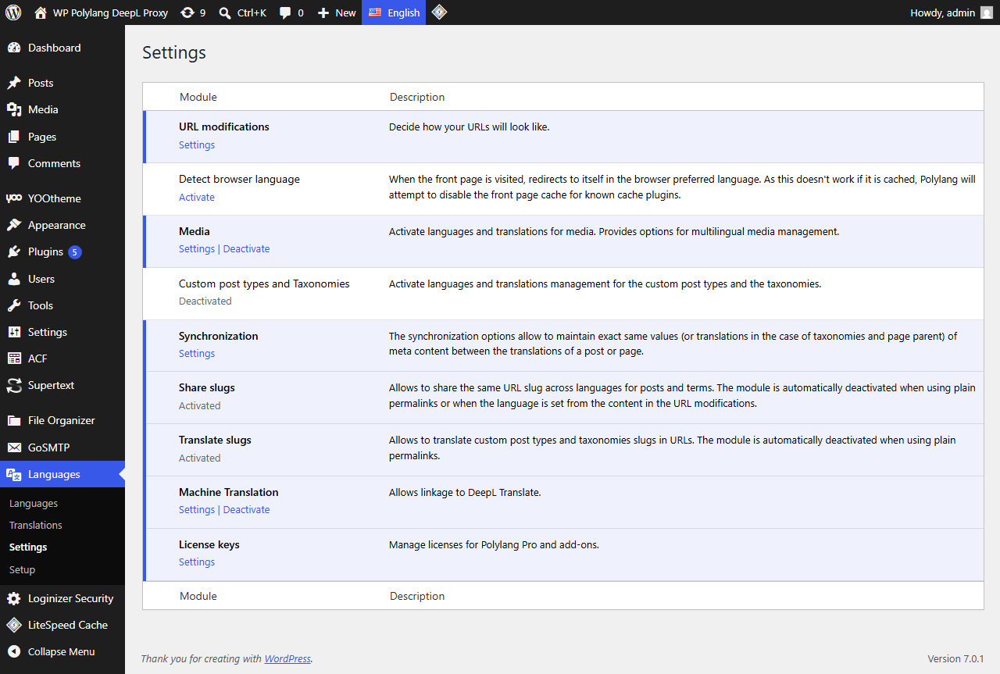
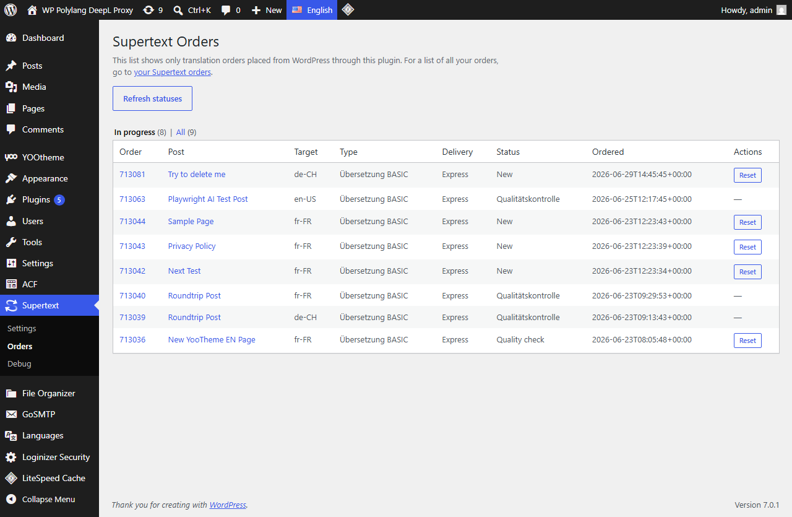

# Supertext for Polylang — User Guide

Adds **Supertext** as a native **machine‑translation** *and* **human (professional)
translation** service in **Polylang Pro**.

- **AI translation** — translate posts/pages instantly through Supertext's AI, using
  Polylang's own translate buttons and a bulk action.
- **Human translation** — order professional translations from WordPress; the finished
  translation is written back automatically when it's done.
- **Page screenshots for translators** — each page sent for human translation is captured
  through its secret preview link and attached to the order, giving the translator the page
  in its real layout (via VibeBoost Screenshots — optional, on by default).
- **Secret preview links** — share an unpublished draft (or hand it to an external tool)
  through a private, expiring URL, without publishing it. Toggle the whole feature on/off in
  Supertext → Settings; enable and manage each page's link from the editor sidebar.

---

## Table of contents

- [Requirements](#requirements)
- [Installation](#installation)
- [Patching Polylang (one‑time)](#patching-polylang-one-time)
- [Configuration](#configuration)
  - [AI / Machine Translation](#ai--machine-translation)
  - [Human (professional) translation](#human-professional-translation)
  - [Checking the status](#checking-the-status)
- [Usage](#usage)
  - [Translate a single post (AI)](#translate-a-single-post-ai)
  - [Bulk AI translation](#bulk-ai-translation)
  - [Bulk human translation](#bulk-human-translation)
  - [The Orders page](#the-orders-page)
  - [YOOtheme pages](#yootheme-pages)
- [Compatibility](#compatibility)
- [How it works](#how-it-works)
- [Troubleshooting](#troubleshooting)
- [Developer reference (filters)](#developer-reference-filters)

---

## Requirements

- **WordPress** 6.0+ and **PHP** 8.1+
- **Polylang Pro** with the **Machine Translation** module
- A **Supertext** account
  - an **AI translation API key** (for AI), and/or
  - an **account email + Order API Key** (for human translation orders)

---

## Installation

1. Copy the `supertext-polylang` plugin folder into `wp-content/plugins/` (or upload the
   ZIP via **Plugins → Add New → Upload Plugin**).
2. Activate **Supertext for Polylang** in **Plugins**.
3. A **Settings** link appears in the plugin's row, and a **Supertext** menu appears in the
   admin sidebar.

---

## Patching Polylang (one‑time)

Polylang Pro keeps its translation services in a fixed internal list with no extension
hook, so Supertext can't register itself until a tiny one‑line filter is added to
Polylang. The plugin does this for you:

1. Go to **Supertext → Settings**.
2. Under **Setup → 1. Patch Polylang**, click **Patch Polylang**.

It backs up the original file (`Factory.php.bak`) and is safe to run again after a Polylang
update. The **status panel** at the top of the Settings page shows whether the patch is
currently applied.

---

## Configuration

### AI / Machine Translation

AI translation is configured in Polylang's own Machine Translation settings.

1. Go to **Languages → Settings → Machine Translation** (the **Settings** page has a
   button that links straight there), enable **Machine Translation**, and choose
   **Supertext**.
2. Enter your **API key**. You can generate it at
   **supertext.com → Integrations → API** (requires the *Admin* role) — the field links to
   it directly.
3. Pick the **Environment** (Live / Staging / Testing).
4. Map each Polylang language to the matching **Supertext language code** (the fields are
   pre‑filled with sensible BCP‑47 defaults — adjust where Supertext differs).
5. Save. The service becomes active once a key is stored.

In Polylang's **Languages → Settings**, the **Machine Translation** module is where you
click **Settings** to choose Supertext and enter the key:

### Human (professional) translation

Professional orders use a **separate** credential (HTTP Basic auth), configured on the
plugin's own settings page.

1. Go to **Supertext → Settings → Translation Services (human)**.
2. Choose the **Environment** (Live / Staging / Testing).
3. Enter your **Account email** and **Order API Key** — find the Order API Key in your
   **Supertext account settings** (the field links to it).
4. Choose the **Write‑back** behaviour:
   - **Allow multiple write‑backs** — re‑apply the translation on every completed‑order
     callback (off by default, so the first result wins and your manual edits are kept).
   - **Translation status** — whether the written‑back translation is a **Draft** or
     **Published**.
5. Save.

### Checking the status

The **status panel** at the top of **Supertext → Settings** shows, at a glance, whether
Polylang Pro is active, whether the patch is applied, and whether the Supertext service is
configured and active. (It's the same page shown above.)

---

## Usage

### Translate a single post (AI)

Open a post, and use Polylang's normal **“translate with Supertext”** button in the
languages panel / metabox to create a translation in the target language. (The Supertext
logo marks the action.)

### Bulk AI translation

1. Go to **Posts** (or **Pages**) → list view.
2. Select one or more items.
3. In the **Bulk actions** dropdown choose **Supertext AI Translation**.
4. Pick the **target language** that appears next to the dropdown.
5. Click **Apply**.

Each selected item is translated and a linked translation is created. A notice reports how
many translations were created. (Items already translated, or whose source language equals
the target, are skipped.)

### Bulk human translation

1. Select items in the **Posts**/**Pages** list.
2. Choose **Supertext Human Translation**.
3. Pick the **target language** and the **translation type** (BASIC / PREMIUM / CREATIVE).
4. The plugin fetches a **live price quote** from Supertext and fills the **delivery**
   dropdown with the available options **and their prices** (e.g. *“Express — 90.00 CHF”*).
   Pick a delivery option.
5. Click **Apply**.

> **About the price quote:** the delivery dropdown stays disabled until a quote arrives.
> When you pick a translation type + target language (with at least one post selected), the
> plugin uploads the content to Supertext and requests a quote, then shows each delivery
> option with its price and delivery date (as a tooltip). Only the delivery options actually
> offered for that language pair are shown — these can differ from one language pair to the
> next. Selecting more posts or changing the type/language re‑fetches the quote.

The content is then sent to Supertext as an order. The confirmation notice shows the
**Order ID**, linked to the order in your Supertext account. When the order is finished,
Supertext calls back and the translation is written into the target post automatically (as
a Draft or Published, per your settings).

> **Page screenshots (VibeBoost Screenshots):** when the *Page screenshots* option is
> enabled (Supertext → Settings, on by default), the plugin also captures a screenshot of
> each page — reached through its secret preview link, so even an unpublished draft is
> included — and attaches it to the order as a **visual reference** for the translator
> (uploaded as a reference file, `DocumentTypeId 3`). This is best‑effort: if the screenshot
> can't be produced (service unreachable, subscription required, or the site isn't publicly
> reachable), the order still goes through without it. The service is still in development;
> heavier use may require a subscription.

### The Orders page

**Supertext → Orders** lists every order placed from WordPress:

- **Order ID** (links to Supertext), **Post**, **Target**, **Type**, **Delivery**,
  **Status**, **Ordered** date.
- **In progress / All** filter (hides *Collected* orders by default).
- **Refresh statuses** pulls the current status from Supertext.
- **Reset** (debug only) removes the per‑post lock so you can order that post again. It
  does **not** cancel the order at Supertext; a confirmation popup explains this.
- A link to your full **Supertext orders** overview.

### YOOtheme pages

YOOtheme Pro stores a page's layout as JSON. The plugin translates it **field‑by‑field**
(only the real text — headings, paragraphs, etc.), leaving the layout structure intact, so
YOOtheme pages translate correctly without breaking. No extra setup is required.

---

## Compatibility

Both AI and human translation send and receive content through **Polylang Pro's own
export / import pipeline** — the exact same pipeline Polylang uses for its XLIFF
export. The practical upshot: **if Polylang Pro can translate it, Supertext can translate
it.** There is no separate, parallel content parser to keep in sync.

### Works out of the box (via Polylang Pro)

| Content | Notes |
|---------|-------|
| **Gutenberg (block editor)** | All core blocks; block content is exported as translatable text, structure preserved. |
| **Classic editor** | Post/page body, title, and excerpt. |
| **Custom fields / post meta** | Only the meta keys you mark as **“Translate”** in *Languages → Settings → Custom fields* (Polylang Pro). Keys left as *Copy* / *Ignore* are not sent. |
| **ACF (Advanced Custom Fields)** | Text, textarea, WYSIWYG, and other text‑bearing fields, through Polylang Pro's built‑in ACF integration. Field‑group translation settings in ACF/Polylang are respected. |
| **Taxonomies & terms** | Category/tag/custom‑taxonomy names and descriptions that Polylang exports. |
| **SEO plugin meta** | Yoast SEO / Rank Math titles & descriptions translate when Polylang is set to translate their meta keys (same rule as any custom field). |

### Added by this plugin

| Content | Notes |
|---------|-------|
| **YOOtheme Pro** | Polylang does **not** handle YOOtheme's JSON layout out of the box. This plugin adds a **field‑by‑field** integration (see [YOOtheme pages](#yootheme-pages)) so its text translates without corrupting the layout. `code` elements are deliberately skipped. |

### Not translated

- **Other page builders** (Elementor, Divi, WPBakery, Beaver Builder, …) unless they ship
  their own Polylang export integration — their content isn't exposed to the pipeline, so
  it passes through untranslated. (A YOOtheme‑style integration could be added per builder.)
- **Custom fields left as *Copy* or *Ignore*** in the Polylang settings.
- **Non‑text data** — IDs, URLs, CSS, shortcodes' structural parts, and raw `code` blocks
  are intentionally left intact.

> In short: **manage *what* gets translated in Polylang's own settings** (custom fields,
> taxonomies, ACF). Supertext simply performs the translation on whatever Polylang hands it,
> plus YOOtheme.

---

## How it works

- **AI:** the plugin registers Supertext as a Polylang machine‑translation service. Content
  is gathered by Polylang, sent to Supertext's AI **file** translation endpoint, and the
  translation is written back through Polylang's normal import pipeline.
- **Human:** the content is uploaded to Supertext and an order is created. A secure,
  signed callback URL receives the “order done” notification, the translated file is
  downloaded, and the text is written back into the target post.

Both paths share the same field extraction, so page‑builder (YOOtheme) and ACF content are
handled the same way.

---

## Troubleshooting

- **“…has not been patched to expose the pll_mt_services filter”** — click **Patch
  Polylang** on **Supertext → Settings**. After a Polylang update, re‑apply it.
- **AI service shows inactive** — make sure Machine Translation is enabled in Polylang and
  a Supertext API key is saved. If a DeepL key is also set, DeepL (listed first) wins —
  clear it to use Supertext.
- **“source and target language are the same”** — you can't translate a post into its own
  language; pick a different target.
- **Human order placed but nothing comes back** — check **Supertext → Debug** for the most
  recent callback payload, and confirm the Environment + Email + Order API Key are correct.

---

## Developer reference (filters)

See the [project README](../README.md) for the full list of filters
(`supertext_polylang_*`, including the YOOtheme field list, endpoint/auth overrides, poll
interval/timeout, and the write‑back options).
